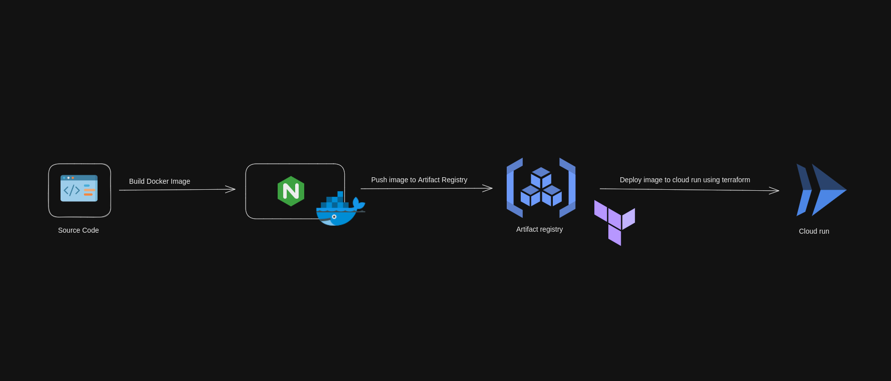

# Web-Cam-Recorder
This is an implementation of web cam recorder in javascript

# Workflow

# Run Locally

> Go inside the project repository and run:

    make build
    make run

> Visit:
    http://localhost:5000
